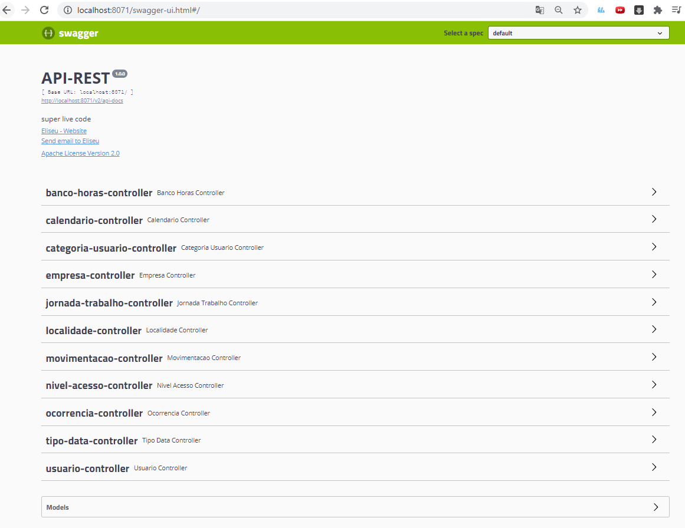
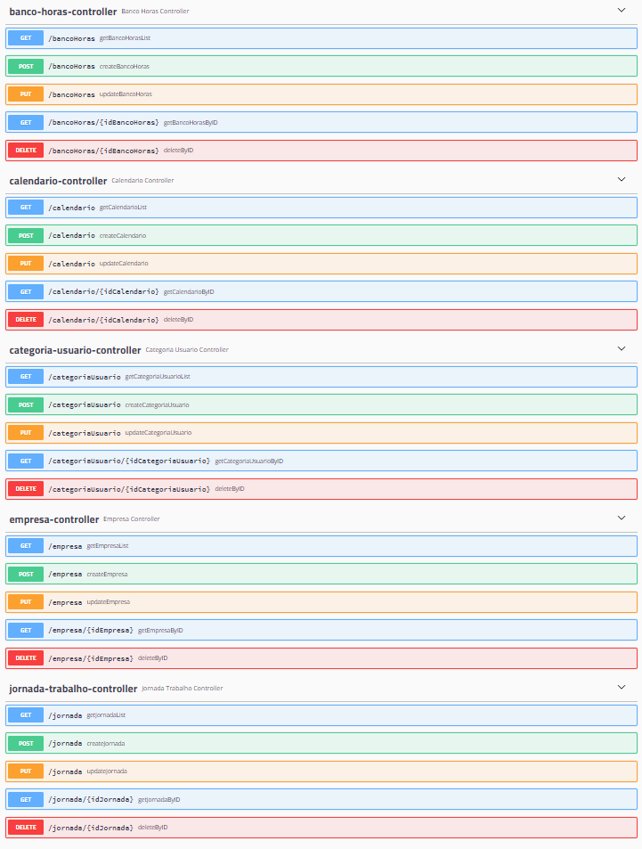
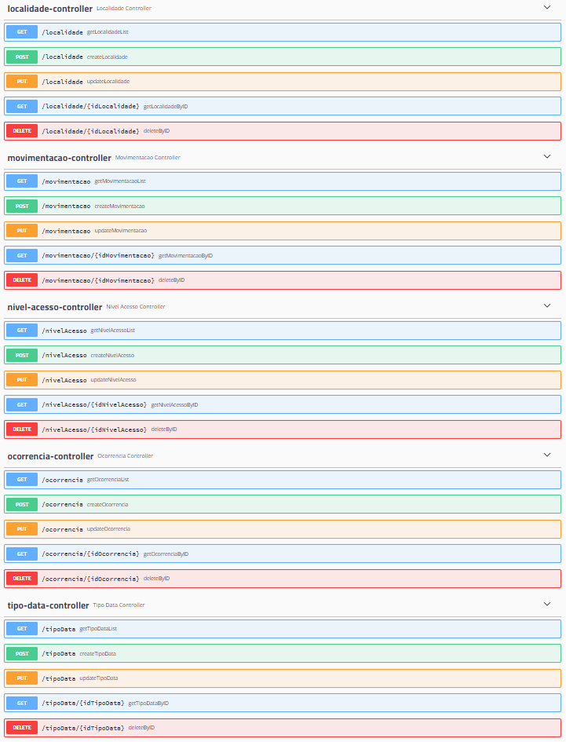
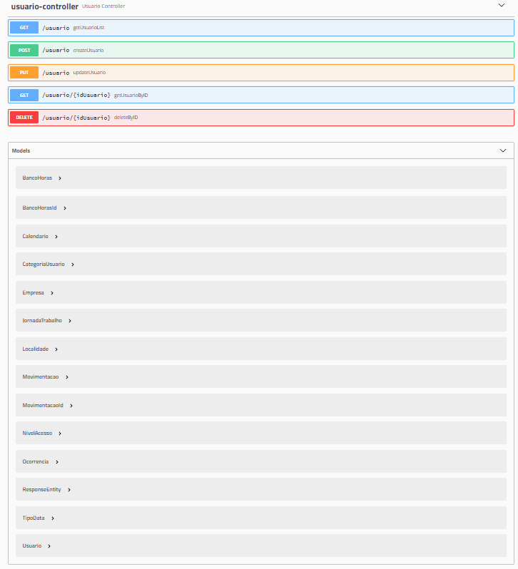
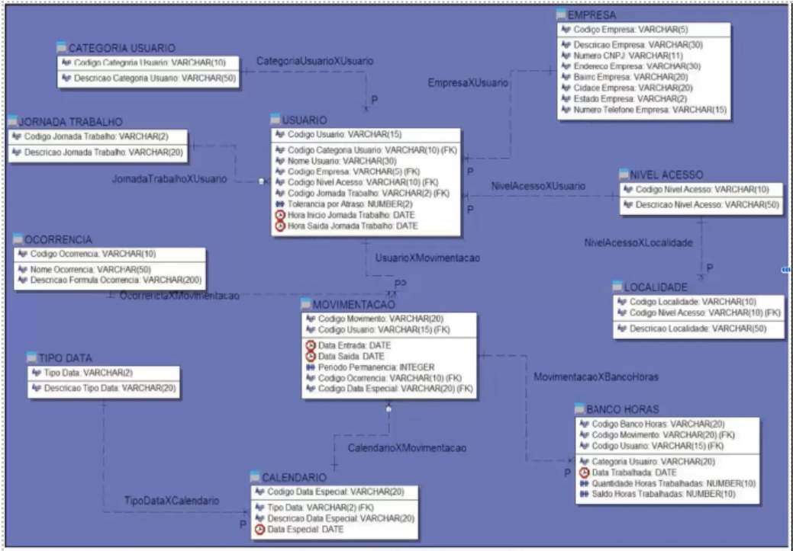
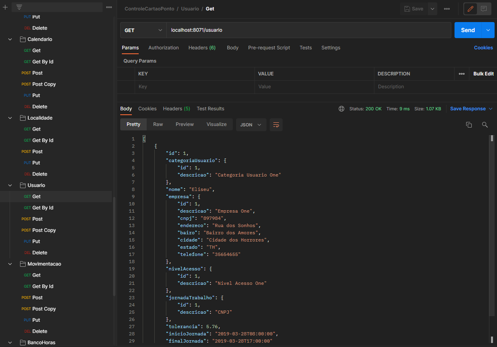
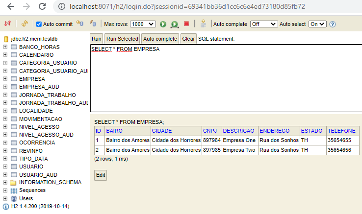

## Sistema Controle de Ponto

API Rest desenvolvida para controle de ponto e acesso dos usuários de uma empresa. Utilizado Java, Spring Boot, Hibernate e Lombok. Documentação da API com Swagger.

Aplicação possui perfil de desenvolvimento rodando em Banco de Dados H2 em Memória com arquivo que carrega dados iniciais automaticamente.

Como diferencial deste projeto tem a utilização de chave primária composta (id(primary key) composto)). Para implementação foi utilizado o @EmbeddedId e o @Embeddable do JPA. Já para auditoria foi utilizado o hibernate envers com a annotation @Audited.

### Visão do projeto no Swagger

#### Detalhamento dos endpoints utilizados

### Relacionamento entre Tabelas

### Utilização do Postman 

### Banco de Dados H2 em Memória com dados iniciais carregados

